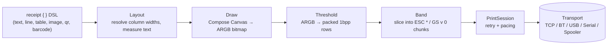

# KMP ESC/POS Printer Sample App

A Kotlin Multiplatform sample app for **[TerminalPrinterKMP](https://github.com/Codemasterlk/KMP-Receipt-Printer)** (`io.github.codemasterlk:escpos-printer`) — a library that prints ESC/POS thermal receipts by rendering them as a single image ("graphic mode"), so any language, script, or font prints correctly on any ESC/POS-compatible printer, over any transport.

One shared Compose Multiplatform UI, one shared `SampleAppState`, running on Android, Desktop, and (partially) iOS.


---

## Contents

- [Why graphic mode](#why-graphic-mode)
- [Features](#features)
- [Supported transports](#supported-transports)
- [How a receipt gets to paper](#how-a-receipt-gets-to-paper)
- [Project structure](#project-structure)
- [Getting started](#getting-started)
- [Configuring a printer](#configuring-a-printer)
- [The library](#the-library)
- [How to implement](#how-to-implement)
  - [1. Connection — open a transport](#1-connection--open-a-transport)
  - [2. Receipt creation — the DSL](#2-receipt-creation--the-dsl)
  - [3. Printer status: success and failure](#3-printer-status-success-and-failure)
  - [4. Rendering the receipt bitmap for the preview](#4-rendering-the-receipt-bitmap-for-the-preview)
  - [5. Handling fonts](#5-handling-fonts)
- [`SampleInvoiceReceipt.kt` walkthrough](#sampleinvoicereceiptkt-walkthrough)
- [Known limitations](#known-limitations)

---

## Why graphic mode

Thermal printers can render text two ways:

- **Native text mode** — the printer's own built-in font draws the characters. Fast, but limited to whatever code pages the printer firmware ships with (Latin, Cyrillic, a handful of others). Scripts like Thai or Devanagari simply aren't printable this way.
- **Graphic mode** — the entire receipt (logo, text, rules, QR, barcode) is rendered into one bitmap on the host, thresholded to 1-bit-per-pixel, and streamed to the printer as raster image data. Any script, any font, any layout — the printer just reproduces pixels.

This library — and this sample app — only ever use graphic mode.

## Features

**Receipt content**
- A fixed 100-item invoice (store header, line items, subtotal/discount/VAT/total, QR code, Code 39 barcode) — dial how many of the 100 items actually print
- Font picker: [Noto Sans](https://fonts.google.com/noto/specimen/Noto+Sans) (default) plus 10 additional bundled Latin faces — Roboto, Open Sans, Lato, Montserrat, Oswald, Raleway, Poppins, Nunito, PT Sans, Merriweather
- **Live preview** rendered at true physical size (1 layout dot = 1 printer dot = 1 screen dot), so what you see is exactly what prints — not scaled to fit the panel

**Printer setup**
- Five transports, one picker (see [below](#supported-transports))
- Full `PrinterProfile` control: paper width (80 mm / 58 mm), raster command (`ESC *` vs `GS v 0`), band height, partial/full cut, drawer pin, feed-before-cut offset
- **Diagnostic print** — one receipt that exercises raster transposition (checkerboard), every bundled font, and QR module scale together, for bring-up on a new printer
- **Status check** — polls `DLE EOT` for paper-out / cover-open on transports that answer it (TCP, Bluetooth SPP)
- **Print log** — every print this session, success or failure, with the real underlying I/O error (not just a generic wrapper message) when something goes wrong

## Supported transports

| Transport | Android | Desktop (Windows/JVM) | iOS |
|---|:---:|:---:|:---:|
| TCP / Wi-Fi (port 9100) | ✅ | ✅ | ✅ |
| Bluetooth SPP | ✅ | ✅ | ❌ (no third-party SPP access — needs MFi) |
| USB | ✅ | ✅ | ❌ (no third-party USB host access) |
| Serial / COM | — | ✅ | — |
| Print spooler (RAW) | — | ✅ | — |

Each platform's sample only offers the picker entries that are actually real there — `availableTransportKinds()` per platform, not a static list with dead options.

## How a receipt gets to paper



A few things the library is deliberate about, worth knowing if you're debugging real hardware:

- **`ESC *` is the default raster mode**, not the faster `GS v 0` — many low-cost clones mishandle large `GS v 0` payloads. `GS v 0` is an opt-in per `PrinterProfile` once a specific printer is verified to handle it.
- **Blank bands collapse to a feed command** instead of being sent as raster data — receipts are mostly whitespace, so this roughly halves the bytes on the wire.
- **No pacing between bands by default** (`PacingPolicy.None`) — modern printers have enough onboard buffer, and every transport's own backpressure (Bluetooth RFCOMM credit flow, USB bulk-transfer blocking, TCP socket buffering) already throttles writes to what the print head can consume. Pacing after *every* 24-dot band was tried and produced visible stepping/vibration instead of a continuous feed.

## Project structure

```
KMPEscPosPrinterSampleApp/
├── androidApp/           Android entry point (MainActivity)
├── desktopApp/           Desktop (JVM) entry point (main())
├── iosApp/                iOS Xcode project (SwiftUI shell around the shared UI)
└── shared/
    └── src/
        ├── commonMain/kotlin/
        │   ├── com/kmpgaraj/kmpescposprintersampleapp/   Platform plumbing (App(), getPlatform())
        │   └── dev/escpos/sample/                        The sample app itself
        │       ├── SampleApp.kt              Compose UI — form pane + live preview pane
        │       ├── SampleAppState.kt         All state + printing/status logic
        │       ├── SampleInvoiceReceipt.kt   The fixed 100-item receipt content
        │       ├── TransportKind.kt          Transport picker enum + expect/actual availability
        │       ├── FormTab.kt                Printer settings / receipt content / print log tabs
        │       ├── Platform.kt               expect PlatformContext + platformTextMeasurer
        │       ├── BluetoothRefresh.kt       expect rememberBluetoothRefresh (runtime permission)
        │       └── PreviewBitmap.kt          Packed 1bpp rows → ImageBitmap for the preview
        ├── androidMain/   …/jvmMain/   …/iosMain/     Per-platform actuals for the above
        └── commonTest/, androidHostTest/, jvmTest/, iosTest/
```

The form pane and live preview pane sit side by side above a 720dp width breakpoint, stacked below it — that split is a layout convenience independent of which tab (`FormTab`) is currently active.

## Getting started

**Requirements**
- JDK 17+ (the project pins Gradle 9.3.1 / AGP 9.1.0 / compileSdk 37)
- Android SDK platform 37 for the Android target
- Xcode, for the iOS target only

**Run it**

```bash
# Android
./gradlew :androidApp:assembleDebug

# Desktop
./gradlew :desktopApp:run

# iOS — open iosApp/iosApp.xcodeproj in Xcode and run from there
```

**Test it**

```bash
./gradlew :shared:testAndroidHostTest   # Android unit tests
./gradlew :shared:jvmTest                # Desktop tests
./gradlew :shared:iosSimulatorArm64Test  # iOS simulator tests
```

## Configuring a printer

1. Pick a transport in **Printer → Connection**.
   - **TCP**: type the printer's IP and port (`9100` is the ESC/POS raw-printing default). There's no network scan — enter it manually.
   - **Bluetooth**: pair the printer in the OS Bluetooth settings first, then **Scan again** to list paired devices.
   - **USB**: plug the printer in via a host/OTG cable; the per-device permission prompt appears the first time you actually print.
   - **Serial / Spooler** (Windows only): pick a COM port or an installed print queue. A spooler queue needs a driver that passes RAW bytes through untouched — "Generic / Text Only" or a vendor ESC/POS driver, not a PostScript/PCL driver that rasterizes the stream.
2. Set the **paper width** (576 dots / 80 mm, or 384 dots / 58 mm) and leave everything else at its default unless a specific printer needs it.
3. Hit **Print diagnostic pattern** first on any printer you haven't used before — it's the fastest way to catch a raster-transposition bug, a missing font, or a bad QR scale before sending real content.
4. If the cutter slices into your receipt's actual content instead of past it, raise **Feed before cut** — there's no way to detect the right offset from software, only from what actually gets cut off in practice.

## The library

This app is a showcase for [`io.github.codemasterlk:escpos-printer`](https://github.com/Codemasterlk/KMP-Receipt-Printer) — Apache-2.0, one Kotlin Multiplatform artifact bundling:

| Module (concept) | What it does |
|---|---|
| `dev.escpos.core` | The `receipt { }` DSL, `PrinterProfile`, `RasterMode`/`CutMode`, ESC/POS command bytes, ARGB→1bpp thresholding |
| `dev.escpos.render` | `ReceiptRenderer` — Compose-based layout, drawing, and memory-flat sliced rendering for long receipts |
| `dev.escpos.fonts` | `NotoFontLookup` — every bundled font, plus the diagnostic receipt |
| `dev.escpos.session` | `PrintSession` — retry policy, pacing/status-barrier policy, chunked writes |
| `dev.escpos.transport.*` | `PrinterTransport` implementations: TCP (ktor-network), Bluetooth SPP, USB, Serial (jSerialComm), print spooler (`javax.print`) |

Add it to a Compose Multiplatform project's `commonMain`:

```kotlin
implementation("io.github.codemasterlk:escpos-printer:0.1.0-alpha01")
```

## How to implement

The five things every integration ends up doing, each grounded in the real call site in `SampleAppState.kt`.

### 1. Connection — open a transport

Every transport is built the same way — construct it from whatever discovery handed you, nothing more:

```kotlin
val transport: PrinterTransport = when (transportKind) {
    TransportKind.Tcp       -> TcpTransport(host = "192.168.1.100", port = 9100)
    TransportKind.Bluetooth -> BluetoothSppTransport(device)   // BluetoothDeviceInfo, from pairedBluetoothDevices()
    TransportKind.Usb       -> UsbPrinterTransport(device)     // UsbDeviceInfo, from usbPrinterDevices()
    TransportKind.Serial    -> SerialPortTransport(port, baudRate = 9600)  // SerialPortInfo, from serialPorts()
    TransportKind.Spooler   -> SpoolerTransport(printer)       // SpoolerPrinterInfo, from spoolerPrinters()
}
```

Every `PrinterTransport`, regardless of which one you picked, exposes the same four members:

```kotlin
transport.availability   // TransportAvailability.Available / .Unavailable(reason) — check with no I/O
transport.state          // StateFlow<ConnectionState> — Disconnected/Connecting/Connected/Failed
transport.connect()      // suspend — establishes the link
transport.write(bytes)   // suspend — queues bytes (may be buffered internally, e.g. the print spooler)
transport.flush()        // suspend — ensures everything write()-ed so far has left the process
transport.close()        // suspend — releases the link; safe to call more than once
```

You don't normally call `connect()`/`write()`/`flush()` yourself — `PrintSession` does (see [§3](#3-printer-status-success-and-failure)). `close()` is the one call the sample always makes itself, in a `finally` block — see why that has to run on `Dispatchers.IO`, [below](#3-printer-status-success-and-failure).

### 2. Receipt creation — the DSL

```kotlin
val body = TextStyle(fontSize = TextSize.Medium)
val bold = body.copy(fontWeight = FontWeight.Bold)

val receipt: Receipt = receipt(defaultStyle = body) {
    text("My Shop", style = bold, align = TextAlign.Center)
    rule()
    line { left("Coffee"); right("350.00") }
    line { left("Total", style = bold); right("350.00", style = bold) }
    space(20)
    qr("https://example.com/receipt/123")
}
```

Every `receipt { }` block:

| Call | Adds |
|---|---|
| `text(value, style, align)` | one line of text |
| `space(dots)` | a blank vertical gap |
| `rule(thickness)` | a horizontal rule |
| `image(RasterImage, align, maxWidthDots)` | a bitmap (logo, etc.) |
| `qr(data, moduleDots, align)` | a QR code |
| `barcode(data, moduleDots, heightDots, align, showText)` | a Code 39 barcode — digits only |
| `line(gap) { left(...); center(...); right(...) }` | one row of independently-aligned cells |
| `table(col1, col2, …) { row(...); header(...) }` | a full table — 2–6 columns compile-time-checked, or `table(List<Col>)` for a runtime column count |

`TextStyle(fontFamily, fontSize, fontWeight, italic, underline)` is `dev.escpos.core`'s own style type, not Compose's — the core module has no Compose dependency at all, so `dev.escpos.render` is what maps it to a real Compose style at draw time.

`customInvoiceReceipt()` in `SampleInvoiceReceipt.kt` is the full worked example — walked through method-by-method [below](#sampleinvoicereceiptkt-walkthrough).

### 3. Printer status: success and failure

```kotlin
val job: Sequence<ByteArray> = ReceiptRenderer(config, measurer, fontLookup).render(receipt)

val session = PrintSession(
    transport = transport,
    pacing = PacingPolicy.None,
    chunkHeightDots = profile.bandHeight,
    retryPolicy = RetryPolicy(),   // 3 attempts, 200ms initial backoff ×2, capped at 5s
)

when (val result = session.print(job)) {
    PrintResult.Success -> { /* every chunk written and flushed */ }
    is PrintResult.Failure -> {
        // result.chunkIndex — which chunk never made it (0-based, write order)
        // result.attempts   — how many tries, including reconnects, before giving up
        // result.cause      — the exception from the last attempt
    }
}
```

`PrintSession.print` connects if needed, writes each chunk, retries a failed chunk under `RetryPolicy` (reconnecting first if the link itself dropped rather than just one write failing), and returns the moment one chunk exhausts its retry budget — a receipt that stops cleanly partway through beats one with a gap in the middle.

`SampleAppState.sendJob()` is the real call site, and worth reading rather than reimplementing from scratch, for two reasons:

- **`TransportIOException` wraps the real cause, and `.message` alone hides it.** Every real transport throws `TransportIOException(message, cause)` on a connect/write failure — `.message` is a generic wrapper ("failed to connect to host:port"), while the actual OS-level reason ("Connection refused", "No route to host") only lives in `.cause`. The sample's `describeError(e)` helper appends `e.cause?.message` whenever it says something `e.message` doesn't, so a failure log line reads *"failed to connect to 10.20.0.3:9100 (Connection refused)"* instead of the generic text alone.
- **Real transport I/O must not run on `Main`.** `sendJob`/`checkPrinterStatus` are launched via `rememberCoroutineScope()`, whose default dispatcher is `Main` — so `session.print(job)`, `transport.connect()`, and every `transport.close()` are wrapped in `withContext(Dispatchers.IO) { }`. Skip this and Android's `StrictMode` kills the first real socket call with `NetworkOnMainThreadException`.

### 4. Rendering the receipt bitmap for the preview

```kotlin
val rows: List<ByteArray> = renderer.renderPreviewRows(receipt)   // packed 1bpp, MSB-first, whole receipt at once
val bitmap: ImageBitmap = rowsToBitmap(profile.dotWidth, rows)
```

`renderPreviewRows` is the non-slicing sibling of `render()` — it returns exactly the thresholded rows a real print job would band and send, but holds the whole receipt's pixels in memory at once (fine for previewing one receipt on screen; `render()` slices instead, to keep peak memory flat on a long receipt actually being sent to a printer).

`rowsToBitmap` (`PreviewBitmap.kt`) exists because there's no portable "write a raw ARGB pixel array into an `ImageBitmap`" API in common Compose — Android and Skia (desktop/iOS) back `ImageBitmap` differently. So instead of writing pixels directly, it *draws*: a white background, then one black `drawRect` per horizontal run of set bits, into a fresh `ImageBitmap` via `CanvasDrawScope` — the same technique `ReceiptRenderer` itself uses internally to build a bitmap from vector content. A set bit means "black dot," MSB-first, matching `dev.escpos.core.threshold`'s own packing — so unpacking bit-by-bit and drawing runs is both correct and far fewer draw calls than one rect per dot for ordinary text/QR content.

### 5. Handling fonts

`TextStyle.fontFamily` is just a `String` id — `dev.escpos.core` has no Compose dependency, so it can't hold a real `FontFamily`. Resolving that id to an actual bundled font is `dev.escpos.fonts.NotoFontLookup`'s job:

```kotlin
val fontLookup: FontLookup = NotoFontLookup.create()   // suspend — reads every bundled font's bytes once
val renderer = ReceiptRenderer(config, measurer, fontLookup)
```

| id | Covers |
|---|---|
| `NotoFontLookup.NOTO_SANS` | Latin/general — the default, and the fallback for a `null` or unrecognized id |
| `NotoFontLookup.CONTENT_FONTS` | 10 more Latin-only faces (`id`/`label` pairs) — Roboto, Open Sans, Lato, Montserrat, Oswald, Raleway, Poppins, Nunito, PT Sans, Merriweather |

Every family is instanced at all nine `dev.escpos.core.FontWeight` steps (Thin…Black) from one bundled variable-font file where the family has a `wght` axis; the three static-only families (Lato, Poppins, PT Sans) render every requested weight as their one bundled Regular instance instead.

Printing non-Latin text is just naming the right font id in a `TextStyle` — no other setup:

```kotlin
val complexScript = TextStyle(fontFamily = NotoFontLookup.NOTO_SANS, fontSize = 28)
text("your text here", style = complexScript)
```

28 dots is the sample's own diagnostic size for complex scripts — at 203dpi (8 dots/mm), Latin stays legible around 16 dots, but scripts with above/below-base marks need roughly 28–32 before the marks start colliding.

Call `NotoFontLookup.create()` once and reuse the `FontLookup` if you can — every call re-reads every bundled font's bytes from resources. `SampleAppState.newRenderer()` currently calls it fresh on every render, which is one thing worth caching before a real release (see [Known limitations](#known-limitations)).

## `SampleInvoiceReceipt.kt` walkthrough

Everything "Print receipt" sends comes from this one file. Nothing in it is user-editable except how many of the 100 items print and which font renders them — store details, invoice number, and the full item catalog are fixed in code, per this sample's "hardcode the receipt content" design.

| Symbol | What it is |
|---|---|
| `ReceiptLineItem` | `data class(name: String, qty: Int, price: Double)` — one printed line item. Plain data, since nothing edits it in place anymore. |
| `STORE_NAME`, `STORE_ADDRESS`, `STORE_PHONE`, `INVOICE_NUMBER`, `CASHIER`, `FOOTER_MESSAGE` | The fixed header/footer text. |
| `DISCOUNT_PERCENT` (5.0), `VAT_PERCENT` (18.0) | Percentages of the subtotal, not flat amounts — a flat discount stopped making sense once the item count became adjustable (1–100) instead of a fixed hand-typed list. |
| `ITEM_CATALOG` | 25 literal `(name, unitPrice)` pairs — real-looking product names, not meant to represent an exhaustive or genuine catalog. |
| `HARDCODED_ITEMS` | A 100-entry `List<ReceiptLineItem>`, built once: `List(100) { index -> ITEM_CATALOG[index % 25] with qty = 1 + (index % 5) }`. Deterministic, not random — the same 100 items every run, cycling the 25-product catalog with a repeating 1–5 quantity pattern. |
| `customInvoiceReceipt(profile, itemCount, fontFamilyId)` | The function that actually builds the `Receipt` — see below. |
| `money(value)` | `"%,.2f".format(value)` — JVM-only (`String.format`); flagged in [Known limitations](#known-limitations) as worth replacing before a real Kotlin/Native build. |
| `solidSquareLogo()` | A 200×200 solid black `RasterImage` standing in for a real logo — the sample has no image-asset pipeline, just enough to exercise `image()` placement. Built from the `BLACK_ARGB` constant (`0xFF000000`). |

**`customInvoiceReceipt(profile, itemCount, fontFamilyId)` step by step:**

1. Builds four `TextStyle`s from `fontFamilyId`: `body`/`small` (24 dots, semi-bold), `title` (28 dots, bold), `totalStyle` (24 dots, bold).
2. `items = HARDCODED_ITEMS.take(itemCount.coerceIn(1, 100))` — the one place `itemCount` actually clips the catalog.
3. Computes `lineTotals`, `subtotal`, `discountAmount`, `vatAmount`, `total` from those `items` only, so the printed numbers can never drift out of arithmetic sync with what's actually listed above them.
4. `invoiceDigits = INVOICE_NUMBER.filter { it.isDigit() }` — both the QR code and the Code 39 barcode at the bottom of the receipt encode this (Code 39 is digits-only; see the encoder's own KDoc for that scope and its "unverified against a real scanner" caveat).
5. Builds the `Receipt` with the DSL, in print order: logo → store header (name/address/phone) → invoice/date/cashier → one `text()` + `line()` pair per item (the name gets its own full-width line so a long product name never crowds the price/qty/total row below it) → subtotal/discount/VAT/total → footer message → QR → barcode.

## Known limitations

- **iOS support is partial.** `PlatformContext`/`platformTextMeasurer`/transport-availability actuals exist for iOS, but `SampleInvoiceReceipt.kt`'s money/date formatting currently uses JVM-only APIs (`java.text.SimpleDateFormat`, `String.format`) that don't compile under Kotlin/Native. Harmless on a Windows dev machine (Kotlin/Native targets are skipped without an Xcode toolchain), but worth swapping for `kotlinx-datetime` and manual formatting before building for a real iOS device.
- **No network discovery.** TCP is manual IP entry only; USB/Bluetooth are enumeration of what's already attached/paired, not active scanning.
- **Serial and the print spooler are Windows/JVM-only** — both report `Unavailable` on Android and iOS.
- The library is pre-release (`0.1.0-alpha01`) — expect API changes before a stable release.
